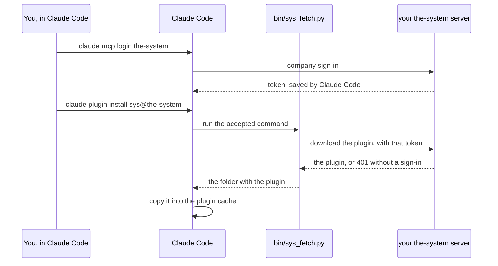

# the-system for Claude Code

The `sys` plugin brings **the-system** into Claude Code: a status line that
shows how your current branch stands, a `/sys` menu, and hooks that follow a
scan you started. the-system is the place where an organisation sees the state
of every repository it owns: findings, a score, and a gate verdict for each
branch.

**This repository is an installer, and only an installer.** The plugin itself
is not stored here. Your the-system server gives it to you after you sign in
with your company account. Without that sign-in, nothing more is installed.

## What you get

| Part | What it does |
| --- | --- |
| Status line | One line under the prompt: the verdict for the branch you are on, and whether a scan is running |
| `/sys` menu | The usual questions in one place: how does this branch stand, what did it add, start a scan |
| Hooks | After you start a scan, Claude Code follows it and tells you when the report is ready |

The MCP tools work without this plugin. The plugin is the part you see in
the terminal.

## Install

Two steps, like Linear's MCP page. Step 1 is required, step 2 is optional.
Take the address from the **Set up platform as MCP** page of your dashboard.

### Step 1 — Connect (required)

The easy way: on that page press **Copy instruction**. Paste it in Claude
Code, in your project folder. The agent connects the address, tells you when
to click, and adds the rules to your repository. It opens a pull request with
two small files: CLAUDE.md and one rule file. Merge it, so your whole team
gets them.

By hand:

1. **Connect the MCP address.**

   ```
   claude mcp add --transport http --scope user the-system <address>
   ```

   You should see: `Added HTTP MCP server the-system with URL: <address> to user config`

2. **Sign in.** A browser tab opens. Press **Continue with Microsoft**, then
   **Return to your editor**.

   ```
   claude mcp login the-system
   ```

   You should see: `Authenticated with "the-system". Its tools are now available in Claude Code.`

   If that does not work, sign in inside Claude Code instead: run `/mcp`, and
   choose **the-system → Authenticate**.

3. **Start Claude Code again.** Now your agent has the tools.

### Step 2 — Add the terminal GUI (optional)

A status line, the `/sys` menu, and a note when a scan is ready. The tools
work without it. It needs the sign-in from step 1. Run these two lines before
the restart in step 1, and one restart covers both steps.

1. **Install the plugin.** Run both lines in your own terminal, not inside a
   Claude Code session. The first one only adds the list and is safe to
   repeat:

   ```
   claude plugin marketplace add viktorkholov/the-system-plugin
   claude plugin install sys@the-system --yes --config url=<address> --config status_line=true
   ```

   You should see: `✔ Successfully installed plugin: sys@the-system (scope: user)`

   Claude Code runs a command from this repository to get the plugin
   (`bin/sys_fetch.py`). `--yes` says yes to that command. `--config` gives
   the plugin its two settings, so the install asks you nothing. Inside a
   Claude Code session `--yes` does not work, on purpose, so an agent cannot
   do this step for you.

2. **Start Claude Code again.** Now you also have the status line and `/sys`.
   `claude mcp list` shows one `the-system`, connected: the plugin uses the
   same address, so there is one connection and one sign-in.

**After the restart — try this**, in any repository. The answers are examples:

- `What did this branch add?` → 2 added, 4 no longer present — against main
- `Show me the blockers on my branch, in the order I should fix them` → S5332 · api/client.py:41 — http, use https

With the terminal GUI:

- `/sys` or `/sys status` → Scan status · What this branch added · Blockers · Update & sign in

The status line is at the bottom of Claude Code, for example s.y.s.t.e.m ● · 2 blocker(s) · report 18:10 (sha: c0ffee1): the gate's verdict for the branch you are on, and the report it comes from.

"Needs authentication" means sign in with /mcp → the-system → Authenticate. "s.y.s.t.e.m ● unreachable" means the row cannot reach the server, and /sys:update names the fix.

## How it works



Claude Code runs the command again once per session. When your server has a
newer plugin, you get it in the next session. Nothing here changes when the
plugin changes, so this repository has nothing to update.

## What stays private

This repository is public, so it is built to hold nothing of value on its own.

- **No plugin code.** Only the installer: the marketplace entry, this README
  and one script.
- **No addresses.** The script sends the token only to the server that token
  was made for, which is the address you connected in step 1. It knows no
  other address.
- **No tokens.** The script reads the token Claude Code already saved when
  you signed in. It never writes it anywhere else, and never puts it on a
  command line.
- **No redirects.** The script does not follow a redirect, so the token
  cannot be carried to another host.
- **Your server decides.** Without a valid sign-in the server answers `401`.
  An account the server does not accept, for example a deactivated one, gets
  `403` with the reason. In both cases nothing is installed.
- **Checked before it is unpacked.** The script refuses a download that is
  not a zip, is too large, holds a path outside its folder, or is not the
  `sys` plugin.

The script uses only the Python standard library, so it installs nothing else.

## Needs

- Claude Code 2.1.229 or later
- `python3`, version 3.8 or later
- macOS or Linux

## If something goes wrong

| You see | What to do |
| --- | --- |
| `you are not signed in to the-system yet` | Do step 1 (connect and sign in), then run the install again |
| `did not accept your sign-in (401)` | Your sign-in ran out. Run `/mcp` → **the-system → Authenticate** again, then install again |
| A `403` with a reason | Your account cannot use the plugin. The reason says why. Ask the owner of your the-system |
| `-y/--yes is ignored inside a Claude Code session` | Run the install in your own terminal, not inside a Claude Code session |

## About

the-system and this plugin are built by Infuse Media for its own teams. Access
comes through your company sign-in. There is no separate account and no key to
ask for.
