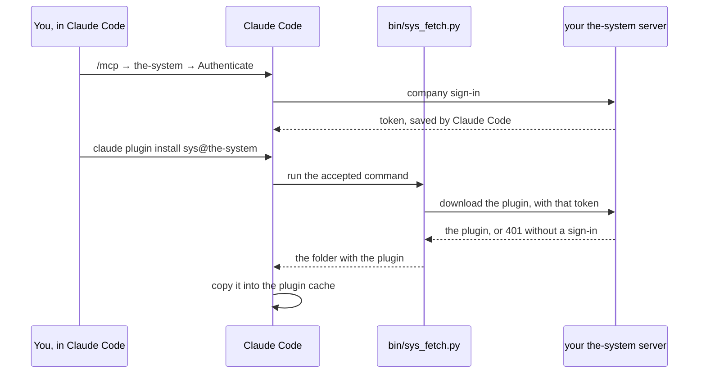

# the-system for Claude Code

The `sys` plugin brings **the-system** into Claude Code: a status line that
shows how your current branch stands, a `/sys` menu, and hooks that follow a
scan you started. the-system is the place where an organisation sees the state
of every repository it owns: findings, a score, and a gate verdict for each
branch.

**This repository is an installer, and only an installer.** The plugin itself
is not stored here. Your the-system server gives it to you after you sign in
with your company account. Without that sign-in, nothing more is installed.

## What you get

| Part | What it does |
| --- | --- |
| Status line | One line under the prompt: the verdict for the branch you are on, and whether a scan is running |
| `/sys` menu | The usual questions in one place: how does this branch stand, what did it add, start a scan |
| Hooks | After you start a scan, Claude Code follows it and tells you when the report is ready |

The MCP tools work without this plugin. The plugin is the part you see in
the terminal.

## Install

You need three steps. The first two are the same as for the MCP tools alone.

1. **Connect the MCP address.** Take it from the **Connect system as MCP**
   page of your dashboard:

   ```
   claude mcp add --transport http --scope user the-system <address>
   ```

2. **Sign in.** Open Claude Code, run `/mcp`, and choose
   **the-system → Authenticate**. You sign in with your company account.

3. **Add this marketplace and install the plugin.** Run these in your own
   terminal, not inside a Claude Code session:

   ```
   claude plugin marketplace add viktorkholov/the-system-plugin
   claude plugin install sys@the-system
   ```

   Claude Code shows you the command it will run (`bin/sys_fetch.py` from
   this repository) and asks you to accept it. Accept it once. Claude Code
   remembers your answer.

## How it works



Claude Code runs the command again once per session. When your server has a
newer plugin, you get it in the next session. Nothing here changes when the
plugin changes, so this repository has nothing to update.

## What stays private

This repository is public, so it is built to hold nothing of value on its own.

- **No plugin code.** Only the installer: the marketplace entry, this README
  and one script.
- **No addresses.** The script sends the token only to the server that token
  was made for, which is the address you connected in step 1. It knows no
  other address.
- **No tokens.** The script reads the token Claude Code already saved when
  you signed in. It never writes it anywhere else, and never puts it on a
  command line.
- **No redirects.** The script does not follow a redirect, so the token
  cannot be carried to another host.
- **Your server decides.** Without a valid sign-in the server answers `401`.
  An account the server does not accept, for example a deactivated one, gets
  `403` with the reason. In both cases nothing is installed.
- **Checked before it is unpacked.** The script refuses a download that is
  not a zip, is too large, holds a path outside its folder, or is not the
  `sys` plugin.

The script uses only the Python standard library, so it installs nothing else.

## Needs

- Claude Code 2.1.229 or later
- `python3`, version 3.8 or later
- macOS or Linux

## If something goes wrong

| You see | What to do |
| --- | --- |
| `you are not signed in to the-system yet` | Do steps 1 and 2, then run the install again |
| `did not accept your sign-in (401)` | Your sign-in ran out. Run `/mcp` → **the-system → Authenticate** again, then install again |
| A `403` with a reason | Your account cannot use the plugin. The reason says why. Ask the owner of your the-system |
| The command was not run | Run the install in your own terminal, not inside a Claude Code session |

## About

the-system and this plugin are built by Infuse Media for its own teams. Access
comes through your company sign-in. There is no separate account and no key to
ask for.
